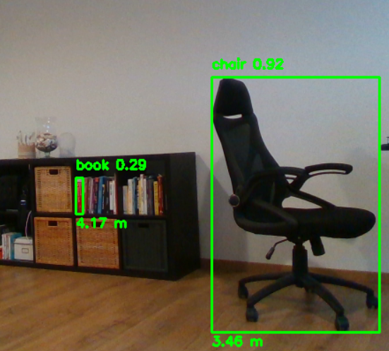

# Object Detection and Depth Measurement with RealSense D435i

This repository contains a Python script that integrates object detection using YOLOv8 with depth measurements from an Intel RealSense D435i camera. The program processes live video streams, detects objects, and provides their distances from the camera in real-time.



## Features
- **RealSense Integration**: Streams color and depth frames using the RealSense D435i camera.
- **Object Detection**: Utilizes the YOLOv8 model for real-time object detection.
- **Distance Measurement**: Calculates and displays the distance to detected objects based on depth data.

## Requirements

The program relies on the following libraries:
- `pyrealsense2`: To interact with Intel RealSense cameras.
- `cv2` (OpenCV): For image processing and display.
- `numpy`: For numerical operations on image data.
- `ultralytics`: To use the YOLOv8 object detection model.

Ensure that you have Python 3.8 or higher installed on your system.

## Installation

1. **Clone the repository**:
   ```bash
   git clone https://github.com/rncntgbrl/realsense3d
   cd realsense3d
   ```

2. **Set up the environment**:
   Install the required libraries using `pip`:
   ```bash
   pip install -r requirements.txt
   ```

3. **Download the YOLOv8 model**:
   Make sure to download a pretrained YOLOv8 model (e.g., `yolov8n.pt`) from the [Ultralytics GitHub repository](https://github.com/ultralytics/ultralytics) and place it in the same directory as the script.

4. **Connect the RealSense D435i camera**:
   Ensure that the RealSense D435i camera is properly connected to your system.

## Usage

Run the script using:
```bash
python main.py
```

The program will start streaming video from the RealSense D435i, detect objects using YOLOv8, and display their distances on the video feed. Press `q` or `ESC` to exit the program.

## Notes

- **YOLOv8 Configuration**: You can modify the confidence threshold of the YOLO model for detection by editing the script (e.g., `model.conf = 0.5`).
- **RealSense Depth Alignment**: The script aligns depth data to the color stream to ensure accurate measurements.
- **Performance**: For optimal performance, ensure your system meets the requirements for running RealSense and YOLO models.

## References
- [Intel RealSense SDK](https://www.intelrealsense.com/sdk-2/)
- [Ultralytics YOLOv8 Documentation](https://github.com/ultralytics/ultralytics)


